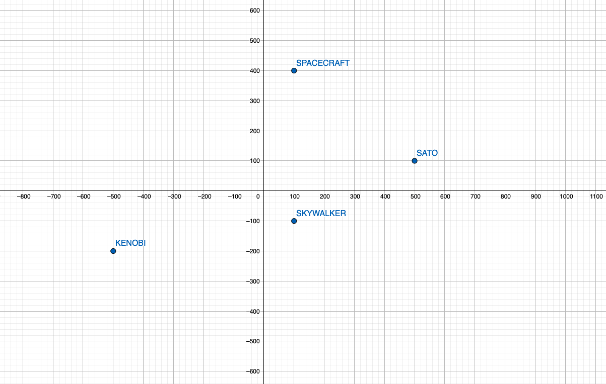

# Test Admission - MercadoLibre

# Contextualización

Se requiere encontrar con exactitud la ubicación de la nave aliada y adicional decodificar el mensaje transmitido por la
misma a los diferentes satellites de la alianza.

Para ello inicialmente se posicionan los satellites en un plano cartesiano en 2D y se ubica temporalmente la posible
ubicación de la nave aliada a partir de las distancias que nos proporcionan entre un satellite y el emisor.


Luego de esto, se traza la distancia como un radio de un círculo esto cada satellite que recibió una distancia del
emisor. A partir de este se traza una circunferencia con `radio = distancia` sobre cada satellite, cuando esta
circunferencia se intercepte con las circunferencias de los demas satellites, los puntos de intercepción generados
entres circunferencias indicaran las posibles coordenadas en donde se encuentra la nave.


Nota: Datos del problema.

Glosario | -/- | -/- |
--- | --- | ---  
Satelite | Kenobi | (-500,-200)
Satelite | Skywalker | (100,-100)
Satelite | Sato | (500,100)

# Documentación

# Instalación

### Requisitos:

- Se requiere tener instalada la version Java 11 o superior.
- Conexion a internet o tener instaladas todas las dependencias basicas de Spring Boot con Maven.
- Tener instalado el programa Postman (Opcional)

### Ambiente Local:

1. Descargar el código fuente del repositorio.
2. Ubicarse en la carpeta raíz `test-admission-mercadolibre`
3. Ejecutar los siguientes comandos.

```shell
./mvnw clean install
./mvnw spring-boot:run
```

4. Comprobar si la aplicación quedo operativos ingresando al enlace `http://localhost:8080/swagger-ui.html#/`

### Ambiente Remoto:

1. Descargar el código fuente del repositorio.
2. Ubicarse en la carpeta raíz `test-admission-mercadolibre`
3. Ejecutar los siguientes comandos.

```shell
heroku apps:create admission-mercado-libre #Solo si se esta creado por primera vez.
heroku git:remote -a admission-mercado-libre 
git push heroku main
```

4. Comprobar si la aplicacion quedo operativos ingresando al
   enlace `https://admission-mercado-libre.herokuapp.com/swagger-ui.html`
   

# Pruebas Unitarias


# Pruebas usuario

Para cada nivel se adjunta una prueba gráfica o datos de entrada y salida, que comprueban el objetivo de cada item de la
prueba de admisión.

Nota: Si tiene instalada la aplicación POSTMAN abrir la siguiente collection de requests (Restfull) para llevar a cabo
las pruebas de forma más dinámica. `https://www.getpostman.com/collections/616c17a239c84a62cdb9` o en su defecto
ejecutar los request desde `https://admission-mercado-libre.herokuapp.com/swagger-ui.html#`

### Nivel 1


### Nivel 2

Los satellites deben estar posicionados de tal forma que puedan triangulan la señal envianda desde la nave emisora. Este
escenario recibe la distancia que existe entre el emisor y cada unos de los satellites, adicional el mensaje es recibido
por cada satellite con cierta cantidad de errores.

- Escenario Exitoso.

```json5
{
   "satellites": [
      {
         "name": "kenobi",
         "distance": 848.528,
         "message": [
            "este",
            "",
            "",
            "mensaje",
            ""
         ]
      },
      {
         "name": "skywalker",
         "distance": 500,
         "message": [
            "",
            "es",
            "",
            "",
            "secreto"
         ]
      },
      {
         "name": "sato",
         "distance": 500,
         "message": [
            "este",
            "",
            "un",
            "",
            ""
         ]
      }
   ]
}
```


- Escenario Fallido.

```json5
{
   "satellites": [
      {
         "name": "kenobi",
         "distance": 100.0,
         "message": [
            "este",
            "",
            "",
            "mensaje",
            ""
         ]
      },
      {
         "name": "skywalker",
         "distance": 115.5,
         "message": [
            "",
            "es",
            "",
            "",
            "secreto"
         ]
      },
      {
         "name": "sato",
         "distance": 142.7,
         "message": [
            "este",
            "",
            "un",
            "",
            ""
         ]
      }
   ]
}
```


